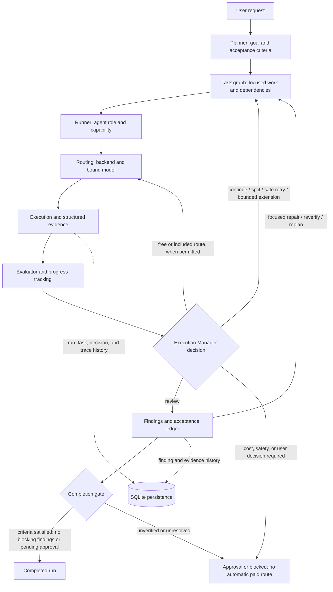

# ludi-agent-kit

[日本語版 README](README.ja.md)

A Windows-first kit for **planning, running, and checking AI coding work** with Pi. Agents ask for capabilities rather than specific models; routing and the Pi adapter select the available provider/model. The kit also includes reusable skills, agent roles, a bounded Context Pack format, and a persistent orchestrator. It succeeds the frozen `codex-setting` project.

> **Start safely:** installation does not configure credentials or working model bindings. Preview a plan before a live run; live agents can use provider quota and may change files when explicitly allowed.

## Choose your starting point

| I want to… | Go to… |
| --- | --- |
| Install for Pi and bind models | [Getting started](docs/getting-started.md) · [日本語](docs/getting-started.ja.md) |
| Work from a source checkout | [Source checkout](docs/getting-started.md#source-checkout) |
| Preview, start, or resume a run | [Orchestrator guide](docs/orchestrator.md) |
| Understand routing and model bindings | [Architecture](docs/architecture.md) · [Pi adapter](adapters/pi/README.md) |
| Prepare a package release | [Distribution checklist](docs/distribution.md) |

### Install for Pi

```powershell
pi install npm:@ludi-uni/ludi-agent-kit
pi list
```

This registers the `pi-workflow`, `project-management`, and `visual-verification` skills and the loop guard and `ludi_orchestrate` extensions. The separate `pi-subagents` package and its agent roles are **not** installed automatically. `npm install` alone does not register Pi resources; use `pi install`. A Git install is also available: `pi install git:github.com/ludi-uni/ludi-agent-kit`.

Before live execution, [configure the user-level model bindings](docs/getting-started.md#bind-models-before-live-use) using IDs actually shown by `pi --list-models`. The repository's `adapters/pi/models.json` is a template, **not** proof of authentication, quota, availability, or price. Review extensions before enabling them: they run with your Pi process permissions. Restart Pi after updating an installed package.

### Preview from a source checkout

```powershell
node scripts/validate.mjs
node scripts/orchestrate.mjs --dry-run "Fix the failing test"
```

The default rules-based preview does not launch agents. For a live run, read the [execution modes and safety rules](docs/orchestrator.md) first; `--apply` permits the coder pipeline to edit the selected repository. Persistent runs can be inspected with `node scripts/orchestrate.mjs --list` and `--show <run-id>`. Source-checkout requirements and the full local test command are in [Getting started](docs/getting-started.md#source-checkout).

## How the pieces connect



The diagram is an overview, not a promise that every run takes every branch. The parent orchestrator keeps the goal and acceptance identities, chooses bounded next actions, and records decisions. A [Context Pack](context-pack/SPEC.md) can pass relevant, validated context to a worker instead of the entire repository. Evidence may complete an evidence-based task without a new file diff; tasks explicitly requiring a code change still need one. Completion depends on acceptance and review evidence, not merely the number of finished tasks. See the [orchestrator guide](docs/orchestrator.md) for modes and limits.

## Repository map

| Path | Responsibility |
| --- | --- |
| `rules/`, `skills/`, `agents/` | Shared operating guidance, skills, and role definitions |
| `routing/` | Capability → logical backend routes and escalation ladders |
| `adapters/pi/` | Pi-specific model bindings, extensions, templates, and optional sync script |
| `context-pack/` | Bounded handoff contract and examples |
| `lib/orchestrator/`, `orchestration/` | Task evaluation, execution decisions, persistence, and policy |
| `scripts/`, `tests/` | CLI tools and checks |

Shared knowledge stays backend-neutral; provider-, model-, CLI-, and installation-specific configuration belongs under `adapters/<backend>/`. For scope and limitations see the [roadmap](docs/roadmap.md). External tools retain their own terms ([third-party dependencies](docs/third-party.md)). This repository is MIT-licensed ([LICENSE](LICENSE)).
